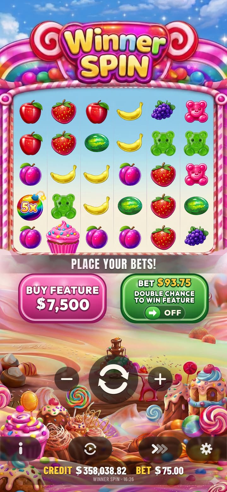
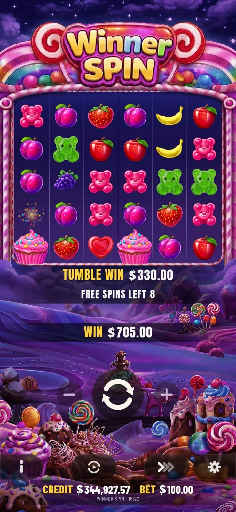
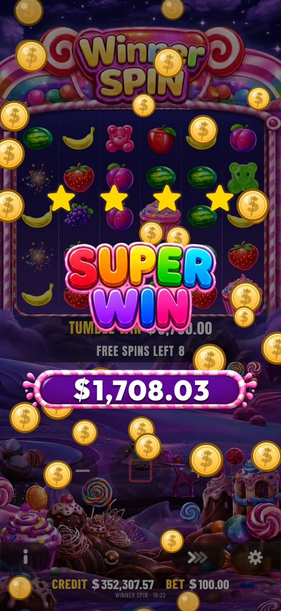

# Winner Spin

Winner Spin is a Flutter slot game prototype with Firebase-backed user accounts, a custom cascading slot engine, free-spin features, multiplier collection, animated win presentation, audio feedback, and RTP-focused simulation tests.

The project is structured as a real application rather than a single demo screen: gameplay logic lives in a domain engine, persistence is abstracted behind repositories, presentation behavior is split into controllers and view models, and the slot math is covered by several diagnostic tests.

## Screenshots







## Highlights

- Flutter app targeting Android, iOS, web, macOS, Linux, and Windows.
- Firebase Authentication for sign in and registration.
- Cloud Firestore persistence for player state and pool state.
- 6x5 cascading slot grid with cluster wins, tumbles, scatter symbols, and multiplier symbols.
- Free spins, retriggers, ante bet mode, buy-feature flow, auto spin, speed controls, and game rules screen.
- Animated game presentation with Lottie, image assets, particle-style effects, win overlays, and audio.
- RTP-aware engine modes: `recovery`, `tight`, `normal`, `generous`, and `jackpot`.
- Monte Carlo and stress tests for RTP, free-spin behavior, buy-feature behavior, multiplier collection, and tumble distribution.

## Tech Stack

- Flutter / Dart
- Firebase Core, Firebase Auth, Cloud Firestore
- audioplayers
- Lottie
- Google Fonts
- flutter_launcher_icons

The project currently requires Dart SDK `^3.10.8`, as defined in `pubspec.yaml`.

## Project Structure

```text
lib/
  app/                         Root MaterialApp setup
  core/                        Shared audio, formatting, and widgets
  features/
    auth/                      Login, registration, and Firebase auth repository
    slot/
      data/                    Local and Firestore repository implementations
      domain/
        engine/                Slot engine, RTP config, grid generation, tumbles
        models/                Spin results, symbols, pool state, history models
        repositories/          Repository contracts
      presentation/            Screens, widgets, controllers, view models, audio

assets/
  audio/                       UI, item, win, and background audio
  animations/                  Lottie animations

test/                          Engine, RTP, buy feature, ante, and widget tests
```

## Gameplay Architecture

The core slot logic starts in `SlotEngine.spin(...)`. It generates a 6-column by 5-row grid, evaluates winning clusters, runs tumble sequences, applies multipliers, checks scatter payouts, and decides whether a free-spin round is triggered.

`PoolState` tracks total bets, total payouts, total spins, and the current RTP-driven game mode. The engine uses this mode to adjust symbol weights, hit rates, free-spin trigger rates, and payout safety guards.

The UI layer is coordinated by `GameViewModel`, which composes smaller controllers for balance, free spins, auto spin, player controls, persistence, game feedback, spin flow, tumble sequencing, and settlement. This keeps the animated presentation separate from the slot math.

## Getting Started

### Prerequisites

Install Flutter and make sure your environment is ready:

```bash
flutter doctor
```

Clone the repository and install dependencies:

```bash
git clone https://github.com/<your-org-or-user>/WinnerSpin.git
cd WinnerSpin
flutter pub get
```

### Firebase Setup

This app uses Firebase Authentication and Cloud Firestore. If you are running the project with your own Firebase project, configure FlutterFire for every platform you plan to use:

```bash
dart pub global activate flutterfire_cli
flutterfire configure
```

Then enable these Firebase products:

- Authentication with email/password provider
- Cloud Firestore

The app expects user documents under the `users` collection. New accounts are initialized with username, email, balance, user balance, and free-spin fields.

### Run the App

```bash
flutter run
```

Run a specific platform when needed:

```bash
flutter run -d chrome
flutter run -d ios
flutter run -d android
flutter run -d macos
```

## Testing

Run the normal test suite with:

```bash
flutter test
```

Some tests are heavy diagnostic simulations and may take a long time because they run millions of spins. For targeted checks, run individual files:

```bash
flutter test test/widget_test.dart
flutter test test/buy_force_trigger_test.dart
flutter test test/multiplier_collector_test.dart
flutter test test/tumble_distribution_test.dart
```

RTP diagnostics live in files such as:

```bash
flutter test test/rtp_simulation_test.dart
flutter test test/per_mode_rtp_test.dart
flutter test test/buy_bonus_rtp_test.dart
```

These simulation tests print metrics such as actual RTP, hit rate, free-spin trigger rate, retrigger rate, mode distribution, pool trajectory, and max single win.

## Important Notes

Winner Spin is a software/gameplay prototype. The slot math, RTP behavior, balances, and persistence model should not be treated as audited, regulated, or production-ready gambling infrastructure without formal review, compliance work, security hardening, and independent mathematical certification.

Firebase configuration and platform files should also be reviewed before publishing a public build.

## Useful Commands

```bash
flutter pub get
dart format .
dart analyze
flutter test
flutter build apk
flutter build web
```

## License

This project is licensed under the Apache License 2.0.

Copyright © 2026, Hakan Güneş and Enes Eken.

See `LICENSE` for details.
