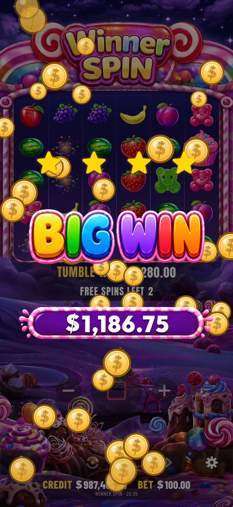
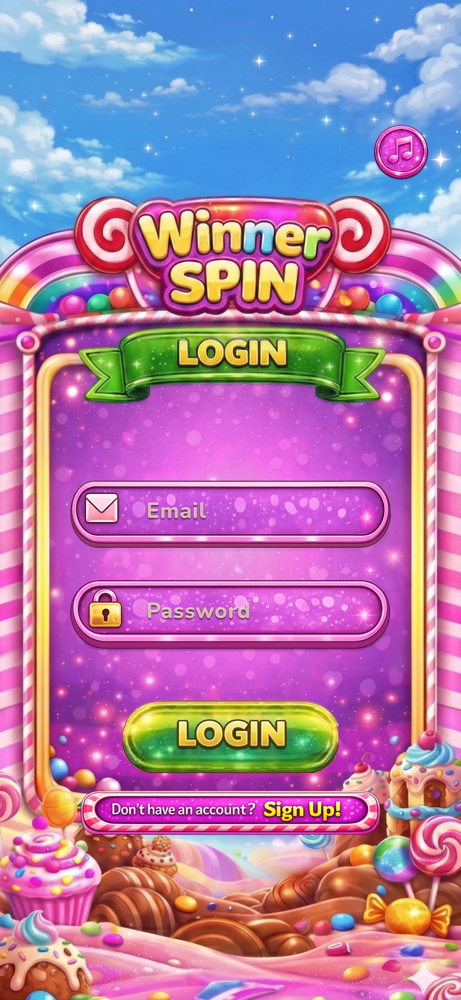
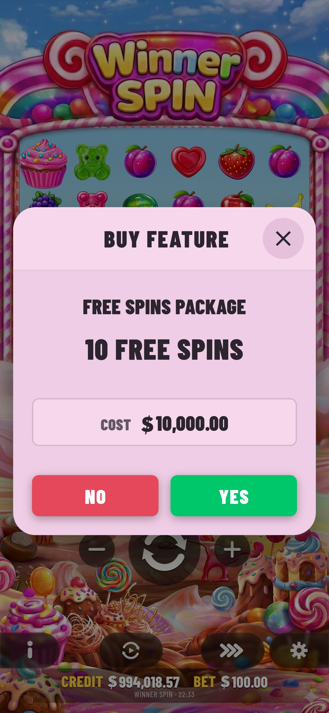
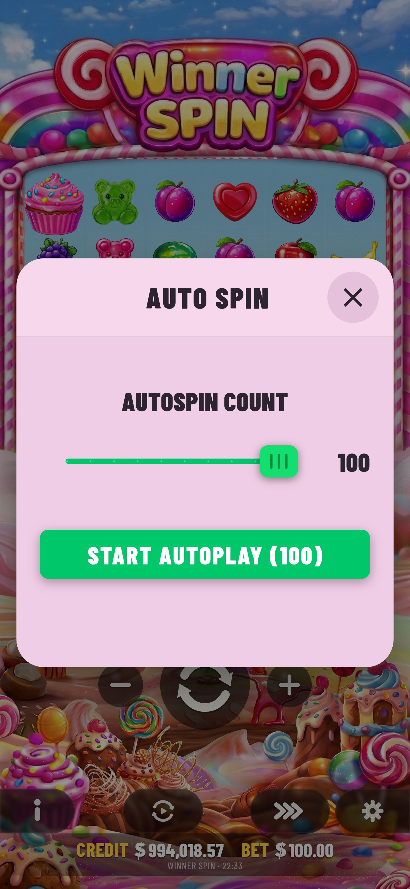
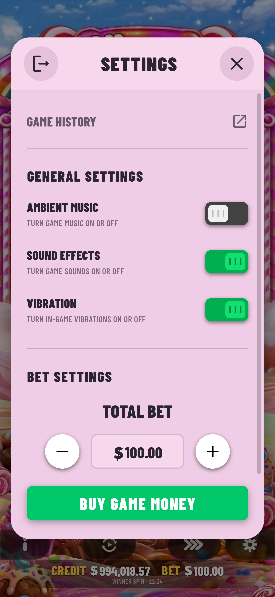
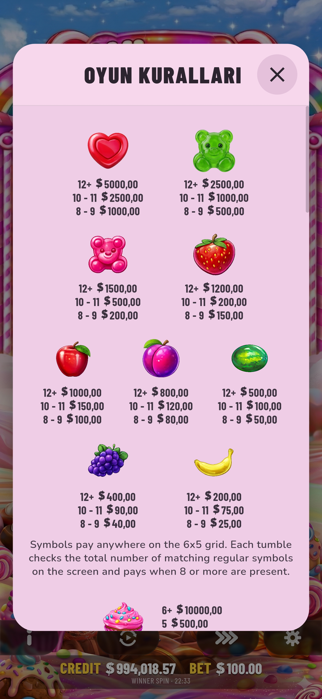
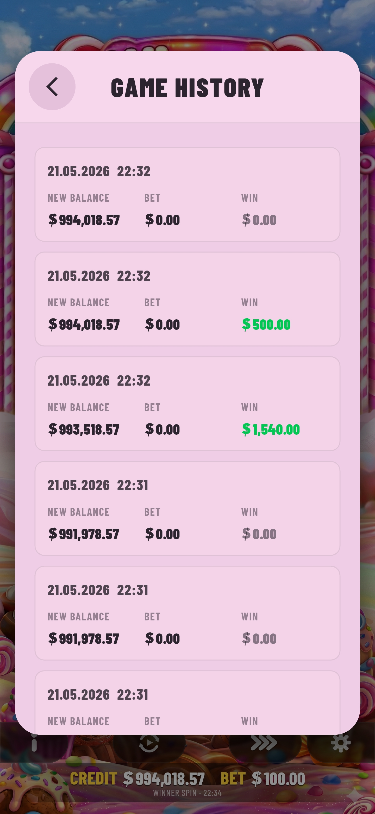
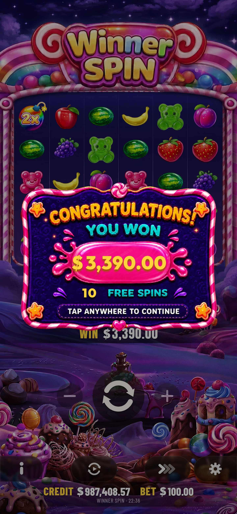

# Winner Spin: Flutter Slot Game

EN English | [TR Türkçe](README_TR.md)

Winner Spin is a Flutter-based mobile slot game project with Firebase-backed user accounts, a custom RTP-aware slot engine, cascading reels, free spins, multiplier collection, animated win presentation, audio feedback, and simulation-focused testing.

The project is structured as a real mobile application rather than a single demo screen. Gameplay logic lives in a domain engine, Firebase persistence is abstracted behind repository contracts, presentation behavior is split into controllers and ViewModels, and the slot math is covered by diagnostic simulation tests.

---

## Screenshots

<p align="center">
  
  
  
</p>

### Application Screens

<p align="center">
  
  
  
</p>

<p align="center">
  
  
  
  
  
</p>

---

## Highlights

- Flutter-based mobile slot game project
- Firebase Authentication for sign in and registration
- Cloud Firestore persistence for player state and pool state
- Feature-first layered MVVM architecture
- Clean Architecture-inspired dependency boundaries
- Custom slot engine written in Dart
- 6x5 cascading slot grid with cluster win detection
- Tumble / cascade sequence simulation
- Scatter symbols and Free Spins trigger system with retrigger logic
- Multiplier collection system
- Buy Feature flow and Ante Bet mode
- Auto Spin controls with Quick Stop interaction
- Animated reel transitions and Big Win / Super Win presentation
- Audio feedback and ambient sound handling
- Game rules, game history, and system settings screens
- RTP-aware pool balancing with mode-based behavior
- Monte Carlo and stress tests for slot math behavior
- Jira-style development workflow with WSPIN task identifiers

---

## Tech Stack

| Category | Technologies |
| --- | --- |
| Mobile Development | Flutter, Dart |
| Backend / Cloud | Firebase Core, Firebase Auth, Cloud Firestore |
| UI & Presentation | Flutter Widgets, Lottie, Google Fonts |
| Audio | audioplayers |
| Architecture | Feature-First Layered MVVM, Clean Architecture boundaries |
| Testing | Flutter Test, RTP simulations, stress tests |
| Workflow | GitHub, Jira-style WSPIN task tracking |

The project currently uses Dart SDK `^3.10.8`.

---

## Architecture

Winner Spin follows a **Feature-First Layered MVVM architecture with Clean Architecture boundaries**.

```text
lib/
  app/
    app.dart
  core/
    audio/
    format/
    widgets/
  features/
    auth/
      data/repositories/
      domain/repositories/
      presentation/
        viewmodels/
        views/
    slot/
      data/repositories/
      domain/
        engine/
        enums/
        models/
        repositories/
      presentation/
        audio/
        models/
        navigation/
        services/
        ui_controllers/
        viewmodels/
        views/
  images/
  main.dart
```

- `domain/` contains the slot math, game rules, models, and repository contracts.
- `data/` contains concrete persistence implementations such as Firestore-backed and local repositories.
- `presentation/` contains screens, widgets, ViewModels, UI controllers, and services.
- The domain layer does not depend on Flutter UI or Firebase implementation details.

For detailed architecture documentation, see [docs/ARCHITECTURE.md](docs/ARCHITECTURE.md).

---

## Slot Engine

The slot engine is a custom Dart-based game engine responsible for grid generation, cluster win detection, tumble/cascade simulation, multiplier collection, scatter evaluation, Free Spins triggering, and RTP-aware pool management.

The engine is split into focused modules:

| File | Responsibility |
| --- | --- |
| `slot_engine.dart` | Main spin orchestration and gameplay result generation |
| `grid_generator.dart` | Safe grid and winning grid generation |
| `tumble_simulator.dart` | Cascade/tumble simulation and cluster win evaluation |
| `multiplier_collector.dart` | Multiplier symbol collection |
| `pool_guard.dart` | Pool safety checks and payout protection |
| `chain_forcer.dart` | Controlled chain/cascade forcing behavior |
| `weighted_random.dart` | Weighted random selection utilities |
| `spin_task.dart` | Spin task modeling |
| `rtp_config.dart` | RTP-related configuration |
| `ante_config.dart` | Ante Bet configuration |
| `buy_config.dart` | Buy Feature configuration |
| `engine_runtime.dart` | Runtime engine state and execution support |

For detailed game mechanics documentation, see [docs/GAME_MECHANICS.md](docs/GAME_MECHANICS.md).

---

## Testing & Simulation

Winner Spin includes both standard Flutter tests and slot-specific diagnostic simulations covering RTP behavior, tumble distribution, multiplier collection, and stress scenarios.

Run the full test suite:

```bash
flutter test
```

Run targeted tests:

```bash
flutter test test/rtp_simulation_test.dart
flutter test test/per_mode_rtp_test.dart
flutter test test/ante_bet_rtp_test.dart
flutter test test/buy_bonus_rtp_test.dart
flutter test test/buy_force_trigger_test.dart
flutter test test/buy_scatter_payout_test.dart
flutter test test/mixed_farm_ante_rtp_test.dart
flutter test test/realistic_player_rtp_test.dart
flutter test test/tumble_distribution_test.dart
flutter test test/multiplier_collector_test.dart
flutter test test/whale_clustering_stress_test.dart
```

Some diagnostic tests run millions of simulated spins to inspect long-term RTP behavior, hit rate, Free Spins trigger frequency, mode distribution, and pool trajectory.

---

## Development Workflow

Winner Spin was developed with a Jira-based task tracking workflow. Commit messages use **WSPIN** task identifiers:

```text
WSPIN-299 Adjusted game screen bottom control spacing
WSPIN-297 Organized slot presentation folders by UI responsibility
WSPIN-296 Refactored slot presentation files into feature folders
WSPIN-295 Extracted Buy Free Spins confirmation screen presentation widgets
WSPIN-285 Extracted Big Win and lingering cluster presentation controllers
WSPIN-284 Extracted free spin award sequence controller
WSPIN-283 Extracted slot spin flow controllers and stage control overlay
WSPIN-282 Extracted GameViewModel controllers and slot state orchestration
```

---

## Contributions

This project was developed as a team-based mobile game project.

Main contribution areas include slot game screen development, game presentation refactors, Free Spins flow, multiplier behavior, Buy Feature UI, Auto Play settings, Game Rules / Game History / System Settings screens, GameViewModel controller extraction, state orchestration, pool and player state persistence fixes, and Jira-based task tracking with WSPIN commit naming.

This project demonstrates experience with Flutter mobile development, Firebase integration, state management, game UI development, custom game logic, simulation-based testing, and team-based software development workflow.

---

## Getting Started

### Prerequisites

```bash
flutter doctor
git clone https://github.com/Winner-Spin/WinnerSpin.git
cd WinnerSpin
flutter pub get
```

### Firebase Setup

This project uses Firebase Authentication and Cloud Firestore.

```bash
dart pub global activate flutterfire_cli
flutterfire configure
```

Then enable Firebase Authentication (Email/Password) and Cloud Firestore. The app expects user documents under the `users` collection.

### Running the App

```bash
flutter run
flutter run -d android
flutter run -d ios
```

### Build

```bash
flutter build apk
flutter build web
```

### Useful Commands

```bash
flutter pub get
dart format .
dart analyze
flutter test
```

---

## Documentation

| Document | Description |
| --- | --- |
| [Architecture](docs/ARCHITECTURE.md) | Detailed architecture, application flow, authentication, and layer responsibilities |
| [Game Mechanics](docs/GAME_MECHANICS.md) | Slot engine, cascade mechanics, free spins, multipliers, RTP, pool system |

---

## Project Status

Winner Spin is a portfolio project designed to demonstrate Flutter mobile development, Firebase integration, feature-first MVVM architecture, custom slot game logic, RTP-aware pool behavior, animated game presentation, simulation-based testing, and Jira-based team workflow.

---

## Important Note

Winner Spin is a software and gameplay project. The slot math, RTP behavior, balances, and persistence model should not be treated as audited, regulated, or production-ready gambling infrastructure without formal mathematical review, compliance work, security hardening, and independent certification. Firebase configuration and platform files should also be reviewed before publishing a public build.

---

## License

This project is licensed under the Apache License 2.0.

Copyright © 2026, Hakan Güneş and Enes Eken.

See `LICENSE` for details.
