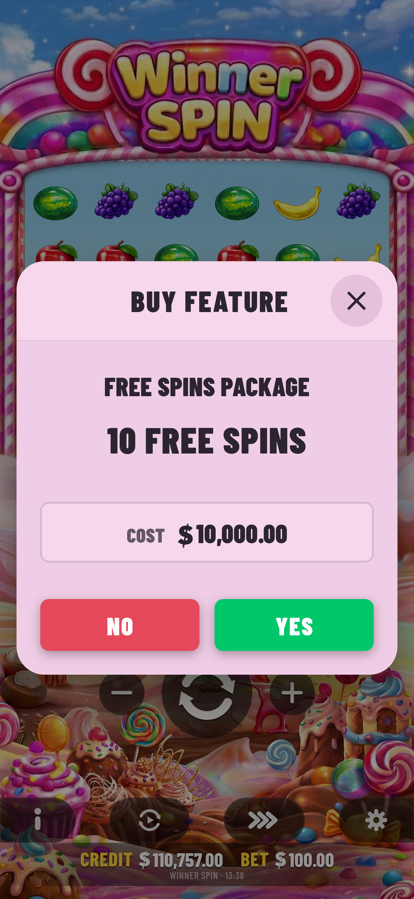
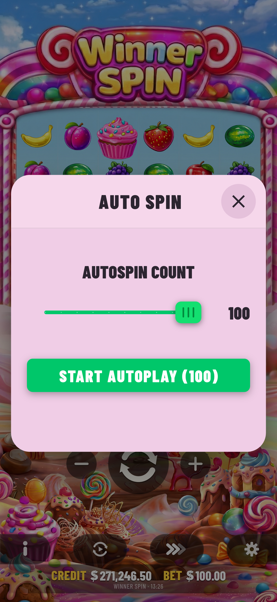
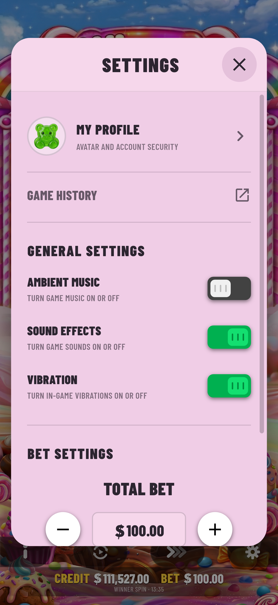
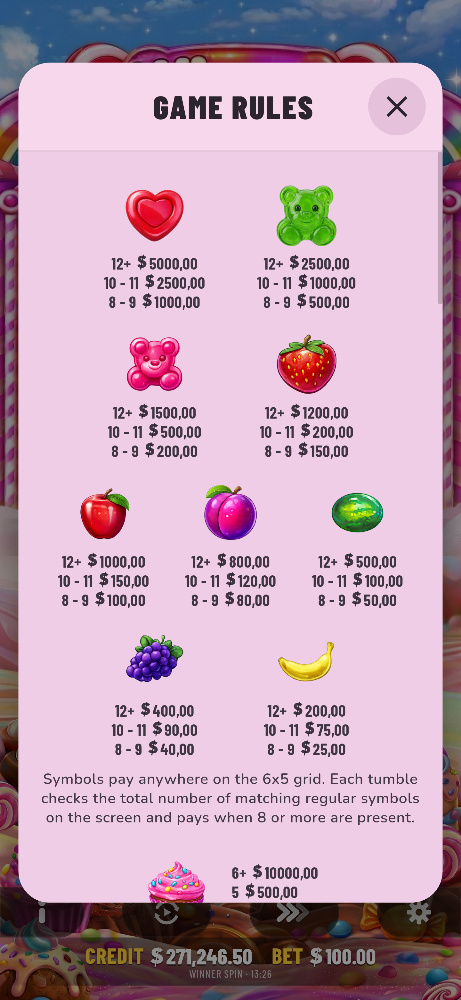
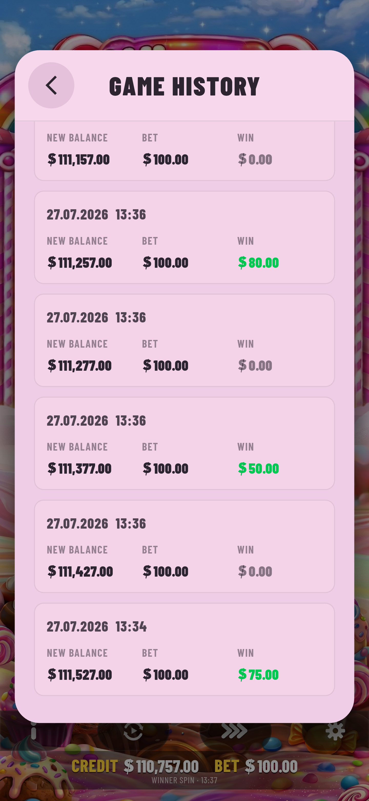
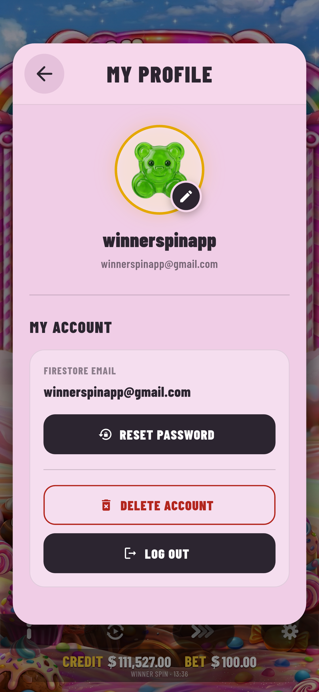
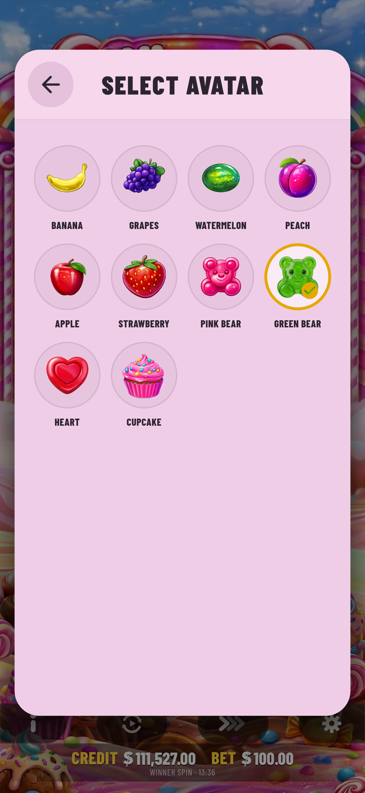
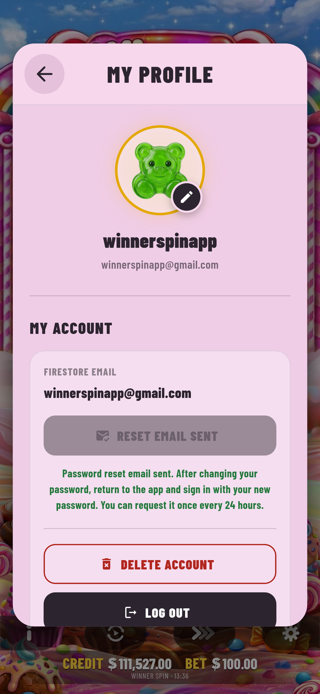
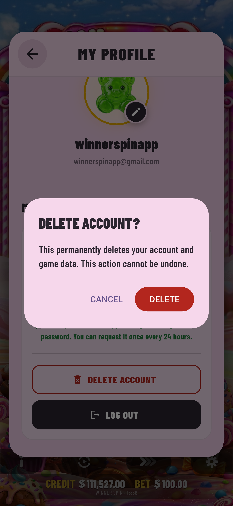
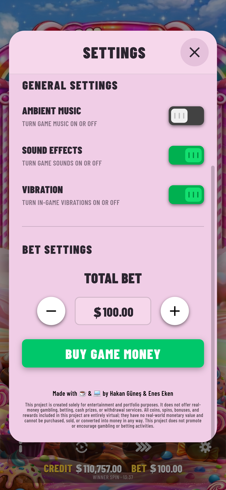

# Winner Spin: Flutter Slot Game

EN English | [TR Türkçe](README_TR.md)

Winner Spin is a mobile-focused Flutter slot game with Firebase-backed accounts, a custom RTP-aware engine, cascading wins, Free Spins, multiplier collection, animated presentation, and simulation-driven math validation.

The current implementation combines a feature-first layered MVVM structure with Clean Architecture-inspired boundaries. Slot calculations remain in the domain layer, persistence is exposed through repository contracts, and presentation behavior is divided among ViewModels, focused controllers, and widgets.

---

## Screenshots

  
  
  

### Application Screens

  
  
  

  
  
  
  

  
  
  
  
  

---

## Current Features

### Accounts and Player State

- Email/password registration and sign-in with Firebase Authentication
- Firebase verification-link flow with a 60-second resend cooldown
- Authentication gate that keeps unverified accounts outside the game
- Profile avatar selection, sign-out, password reset, and account deletion
- Password-reset requests limited to once every 24 hours per account
- Firestore persistence for profile, balance, Free Spins, and per-player pool state
- Firestore Security Rules that isolate profiles by authenticated UID, validate the required initial profile schema and defaults, and reject unauthenticated or cross-account access
- Emulator-tested security boundaries that deny client access to server-owned collections

### Gameplay

- 6 × 5 pay-anywhere grid with tumble/cascade sequences
- Wins for 8 or more matching regular symbols anywhere on the grid
- Payout tiers at 8, 10, and 12+ matching symbols
- 10 Free Spins from 4+ base-game scatters
- 5 additional Free Spins from 3+ scatters during a Free Spins round
- 2×, 3×, 5×, 10×, 25×, 50×, and 100× multipliers
- Buy Feature priced at 100× the selected bet
- Ante Bet priced at 1.25× the base bet and doubling the configured base Free Spins trigger probability
- Auto Spin, Quick Stop, Big Win presentation, game history, rules, and settings
- Virtual in-game CREDIT top-up screen; it does not process real-money deposits
- Free Spins autoplay that starts only after the award popup is acknowledged

### Reliability and Performance

- Slot calculation runs through Flutter compute to keep engine work off the UI isolate
- Calculated but interrupted standard normal and active Free Spin results preserve their exact payout and resulting state
- Recovery records use a unique spin ID so history and settlement can be retried safely
- Ambient music pauses at application lifecycle level and respects the persisted preference
- Short sound effects use bounded, low-latency pools to prevent unbounded player growth
- Bomb and UI effects are preloaded to reduce first-use frame pressure
- Heavy images are precached in stages and decoded according to device width
- Local history, recovery, disclaimer, and music-preference writes use file-backed persistence

---

## Tech Stack

| Category | Technologies |
| --- | --- |
| Mobile | Flutter, Dart |
| Backend | Firebase Authentication, Cloud Firestore, Cloud Functions |
| Presentation | Flutter widgets, Lottie, Google Fonts |
| Audio | audioplayers |
| Local persistence | dart:io, path_provider, atomic temporary-file replacement |
| Architecture | Feature-first layered MVVM with Clean Architecture-inspired boundaries |
| Testing | Flutter Test, Firebase Emulator Suite, RTP simulations, stress and regression tests |
| Workflow | GitHub and Jira-style WSPIN task tracking |

- Dart SDK constraint: **^3.10.8**
- Cloud Functions runtime: **Node.js 22**
- Intended targets: **Android and iOS**

The current client imports dart:io for local persistence, so web is not an advertised build target.

---

## Architecture

~~~text
lib/
  app/
  core/
    audio/
    firebase/
    format/
    network/
    widgets/
  features/
    auth/
      data/
      domain/
      presentation/
    slot/
      data/
      domain/
        engine/
        enums/
        models/
        repositories/
        services/
      presentation/
        audio/
        models/
        navigation/
        services/
        ui_controllers/
        viewmodels/
        views/
  main.dart
test/
  app/
  core/
  features/
  firebase/
package.json
~~~

- **Domain** owns slot rules, engine modules, models, services, and repository contracts.
- **Data** implements Firebase and local-file repositories.
- **Presentation** owns screens, widgets, ViewModels, UI controllers, navigation, audio adapters, and presentation services.
- **Core** contains application-wide audio, Firebase initialization, formatting, connectivity, and reusable UI utilities.

The architecture is intentionally pragmatic rather than a strict dependency-injection implementation: domain code is independent of Flutter UI and Firebase, while presentation composition points create some concrete repositories.

See [Architecture](docs/ARCHITECTURE.md) for the full flow.

---

## Persistence and Interrupted-Spin Recovery

| Data | Storage | Behavior |
| --- | --- | --- |
| Authentication identity | Firebase Authentication | Email/password identity and verified-email claim |
| Profile and player state | Cloud Firestore | Username, avatar, balance, last win, and Free Spins state |
| Pool state | Cloud Firestore | Per-player bet, payout, and spin counters |
| Game history | Local application file | Most recent 30 entries |
| Pending spin recovery | Local application file | Exact calculated payout, balance, Free Spins state, pool snapshot, and history ID for standard normal/active Free Spin paths |
| Disclaimer state | Local application file | First-launch acknowledgement |
| Music preference | Local application file | Ambient-music enabled/disabled state |

For standard normal and active Free Spin paths, a recovery record is written after calculation and before normal presentation settlement completes. If the process is terminated during the animation, the same totalWin and resulting state are restored on the next launch. A result is not randomly recalculated during recovery. The paid Buy Feature trigger currently follows a dedicated path outside this recovery journal.

---

## Slot Math and RTP Model

The visible payout calculation is:

~~~text
totalWin = baseWin × max(1, sumOfFinalMultipliers) + scatterPayout
~~~

The engine pays the calculated result directly; it does not substitute a separate random payout amount after the symbols are shown.

The pool model retains five operating modes:

| Mode | Configured profile target | Role |
| --- | ---: | --- |
| recovery | 89.0% | Protects the pool after material overpayment |
| tight | 92.0% | Reduces payout pressure |
| normal | 96.5% | Default balanced profile |
| generous | 98.0% | Raises payout potential while underpaying |
| jackpot | 108.0% | Allows short high-payout periods under specific conditions |

The guarded long-run target and the Normal profile target are **96.5%**. Protective modes intentionally have different profile targets; their distribution and pool feedback are designed to converge around the guarded long-run target rather than make every mode independently return 96.5%.

These figures are configuration and simulation targets, not an independently certified gambling-math result.

See [Game Mechanics](docs/GAME_MECHANICS.md) for implementation-level rules.

---

## Testing and Simulation

The repository currently contains 45 Dart test files plus a Firestore Security Rules emulator suite. Coverage includes widgets, controllers, persistence, lifecycle, audio, recovery, account isolation, RTP, and stress behavior. Eleven root-level Dart tests are math diagnostics or simulations and may process a large number of spins.

Run fast targeted checks during normal development:

~~~sh
dart analyze
flutter test test/app/app_lifecycle_test.dart
flutter test test/core/audio
flutter test test/features/slot/presentation/viewmodels/game_viewmodel_recovery_test.dart
~~~

Install the root Node test dependencies once, then validate Firestore account isolation and server-owned collections:

~~~sh
npm install
npm run test:firestore
~~~

Run the complete suite when full verification is required:

~~~sh
flutter test
~~~

Run math diagnostics explicitly:

~~~sh
flutter test test/rtp_simulation_test.dart
flutter test test/per_mode_rtp_test.dart
flutter test test/mode_weight_calibration_test.dart
flutter test test/ante_bet_rtp_test.dart
flutter test test/buy_bonus_rtp_test.dart
flutter test test/mixed_farm_ante_rtp_test.dart
flutter test test/realistic_player_rtp_test.dart
flutter test test/tumble_distribution_test.dart
flutter test test/whale_clustering_stress_test.dart
~~~

Some simulation tests are intentionally long-running and are not required for every presentation-only change.

---

## Getting Started

### Prerequisites

- Flutter SDK compatible with Dart ^3.10.8
- Node.js 20 or newer with npm for the Firestore Security Rules tests
- Android Studio/Xcode and a configured mobile target
- A Firebase project
- Firebase CLI and FlutterFire CLI for Firebase reconfiguration

~~~sh
git clone https://github.com/Winner-Spin/WinnerSpin.git
cd WinnerSpin
flutter pub get
flutter doctor
~~~

### Firebase Configuration

1. Configure the project if the checked-in Firebase options do not match your Firebase project:

   ~~~sh
   dart pub global activate flutterfire_cli
   flutterfire configure
   ~~~

2. Enable **Authentication > Email/Password** and create Cloud Firestore.

3. Deploy the Firestore rules:

   ~~~sh
   firebase deploy --only firestore:rules --project=YOUR_PROJECT_ID
   ~~~

Firebase's built-in verification link does not require Cloud Functions. Full account deletion does require the callable deleteAccount function and Cloud Functions billing eligibility:

~~~sh
firebase deploy --only functions:deleteAccount --project=YOUR_PROJECT_ID
~~~

Deploy only the Firebase services required by the active application flow. Email verification itself does not require a Cloud Function.

See [Firebase Email Verification Setup](FIREBASE_EMAIL_VERIFICATION_SETUP.md) for the exact distinction.

The production Android application ID is `com.winnerspin.game`. Register this exact ID in Firebase and add the release certificate SHA-1 and SHA-256 fingerprints. After enabling Google Play App Signing, also register the Play app-signing certificate fingerprints when they differ from the upload certificate.

Android App Check uses the debug provider in debug/profile builds and Play Integrity in release builds. Register local debug tokens in Firebase Console without committing them. Real Play Integrity validation requires a release build distributed through a Google Play Internal Testing track; a locally installed release build does not complete that production check. App Check is not currently activated for iOS, so keep enforcement disabled until an iOS production provider is configured and metrics confirm valid traffic from every supported production client.

### Android Release Signing

Android release builds require a private upload keystore and never fall back to the debug key. Keep the keystore outside the repository, copy `android/key.properties.example` to the ignored `android/key.properties` file, and fill in the local path and credentials.

CI environments may provide `ANDROID_KEYSTORE_PATH`, `ANDROID_KEYSTORE_PASSWORD`, `ANDROID_KEY_ALIAS`, and `ANDROID_KEY_PASSWORD` instead. All four values must come from the same source. Never commit keystores, signing credentials, service-account files, or App Check debug tokens. Use Google Play App Signing and retain encrypted backups of the upload key and its credentials.

### Run and Build

~~~sh
flutter run
flutter run -d android
flutter run -d ios

flutter build apk
flutter build appbundle
flutter build ios
~~~

---

## Documentation

| English | Türkçe | Scope |
| --- | --- | --- |
| [README](README.md) | [README_TR](README_TR.md) | Project overview and setup |
| [Architecture](docs/ARCHITECTURE.md) | [Mimari](docs/ARCHITECTURE_TR.md) | Layers, runtime flow, persistence, and performance boundaries |
| [Game Mechanics](docs/GAME_MECHANICS.md) | [Oyun Mekanikleri](docs/GAME_MECHANICS_TR.md) | Slot rules, Free Spins, multipliers, RTP, and controls |
| [Firebase Email Verification Setup](FIREBASE_EMAIL_VERIFICATION_SETUP.md) | [Firebase E-posta Doğrulama Kurulumu](FIREBASE_EMAIL_VERIFICATION_SETUP_TR.md) | Verification link, rules, and account-deletion deployment |

---

## Project Status and Disclaimer

Winner Spin is an actively developed portfolio/gameplay project. Its math, pool behavior, balances, recovery model, and Firebase configuration must not be treated as audited, regulated, secure, or production-ready gambling infrastructure without formal mathematical review, security hardening, compliance work, and independent certification.

---

## License

Licensed under the Apache License 2.0.

Copyright © 2026, Hakan Güneş and Enes Eken.

See [LICENSE](LICENSE) for details.
