# Winner Spin: Flutter Slot Oyunu

TR Türkçe | [EN English](README.md)

Winner Spin; Firebase destekli hesaplar, özel RTP duyarlı motor, kademeli kazançlar, Ücretsiz Dönüşler, çarpan toplama, animasyonlu sunum ve simülasyon tabanlı matematik doğrulaması içeren, mobil odaklı bir Flutter slot oyunudur.

Güncel uygulama, feature-first katmanlı MVVM yapısını Clean Architecture'dan esinlenen sınırlarla birleştirir. Slot hesaplamaları domain katmanında kalır, kalıcılık repository sözleşmeleri üzerinden sunulur; sunum davranışı ise ViewModel'ler, odaklı controller'lar ve widget'lar arasında bölünür.

---

## Ekran Görüntüleri

  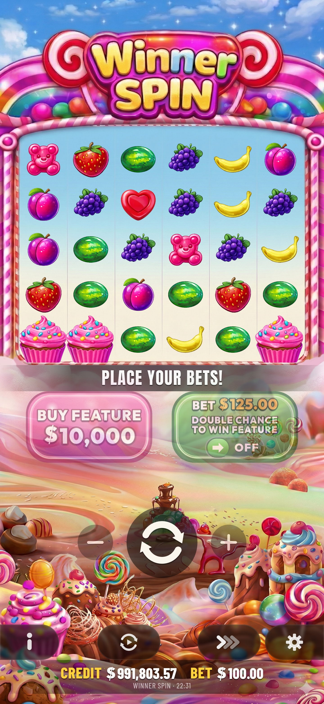
  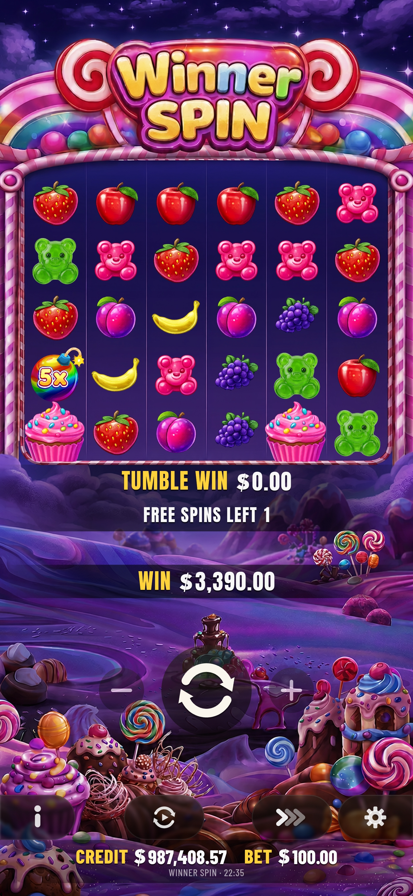
  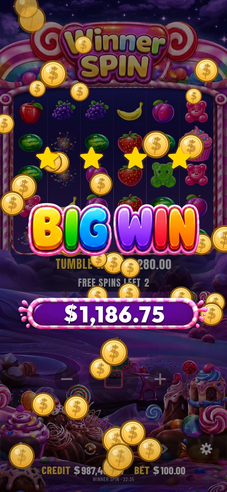

### Uygulama Ekranları

  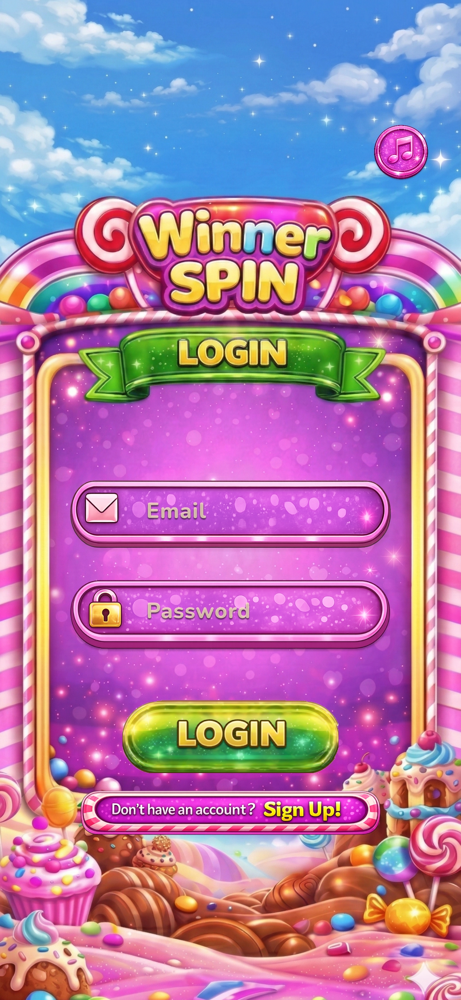
  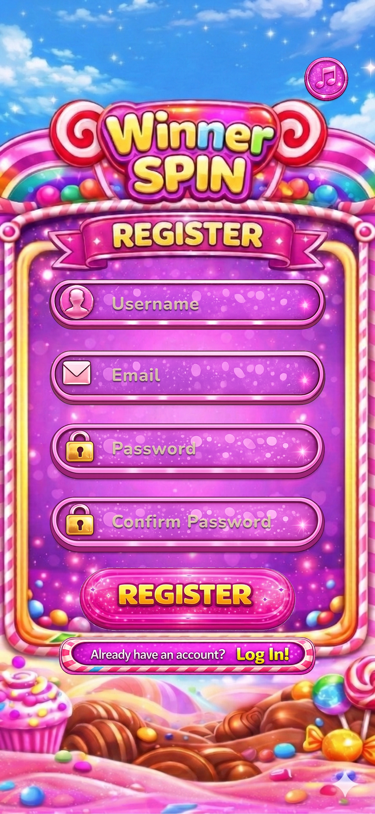
  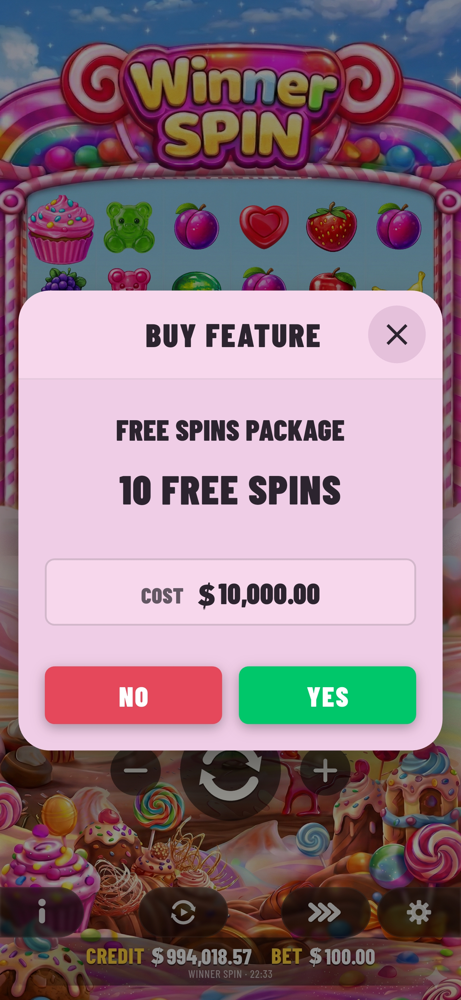

  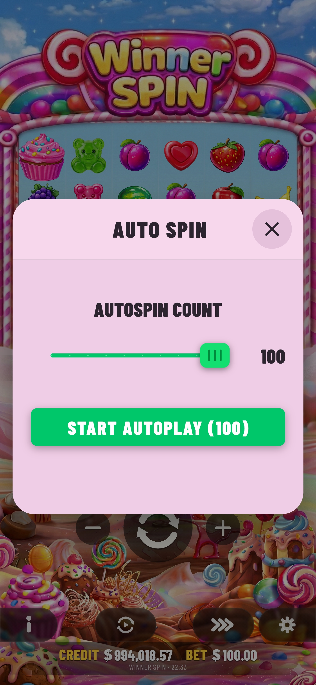
  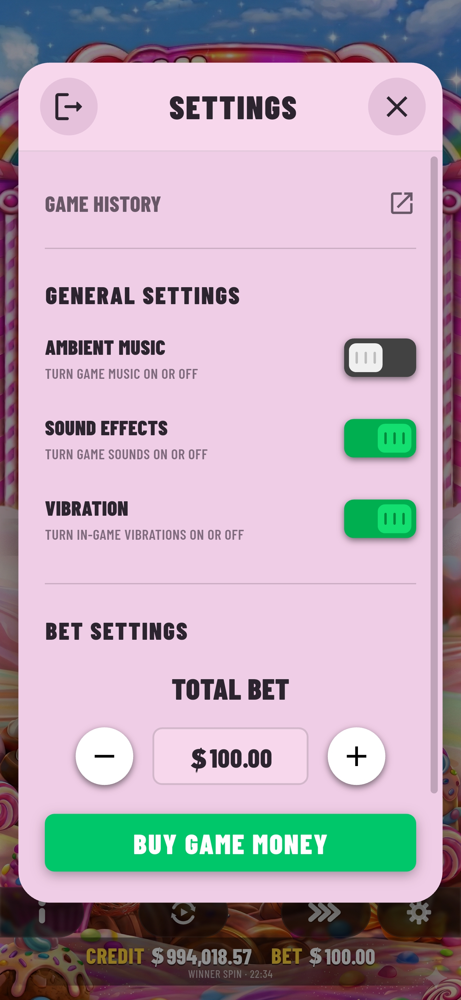
  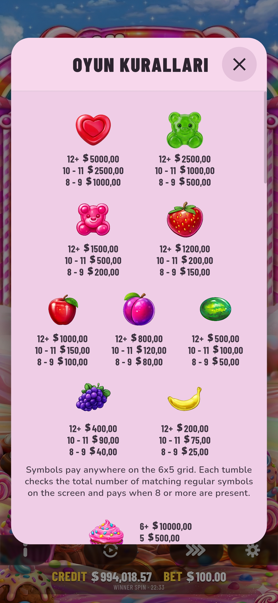
  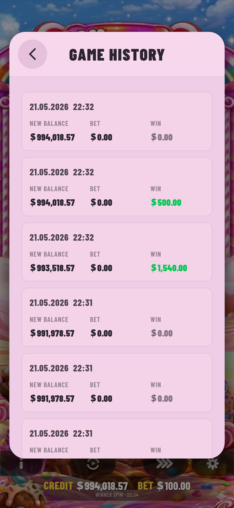
  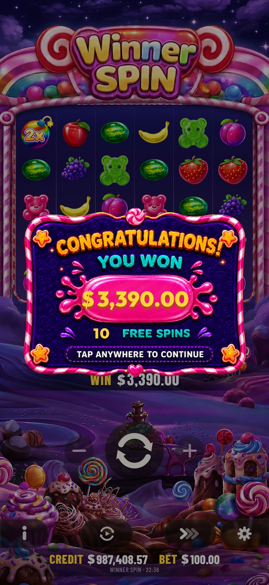

---

## Güncel Özellikler

### Hesaplar ve Oyuncu Durumu

- Firebase Authentication ile e-posta/parola kaydı ve girişi
- 60 saniyelik yeniden gönderme bekleme süresine sahip Firebase doğrulama bağlantısı akışı
- Doğrulanmamış hesapları oyunun dışında tutan kimlik doğrulama kapısı
- Profil avatarı seçimi, çıkış, parola sıfırlama ve hesap silme
- Parola sıfırlama isteklerinin hesap başına 24 saatte bir ile sınırlandırılması
- Profil, bakiye, Ücretsiz Dönüşler ve oyuncuya özel havuz durumu için Firestore kalıcılığı

### Oynanış

- Tumble/cascade dizilerine sahip 6 × 5 pay-anywhere grid
- Grid'in herhangi bir yerindeki aynı normal sembolden 8 veya daha fazlasıyla kazanç
- 8, 10 ve 12+ eşleşen sembolde ödeme kademeleri
- Ana oyunda 4+ scatter ile 10 Ücretsiz Dönüş
- Ücretsiz Dönüş turunda 3+ scatter ile 5 ek Ücretsiz Dönüş
- 2×, 3×, 5×, 10×, 25×, 50× ve 100× çarpanlar
- Seçili bahsin 100 katı fiyatla Özellik Satın Alma
- Temel bahsin 1,25 katı fiyatla oynanan ve yapılandırılmış ana Ücretsiz Dönüş tetikleme olasılığını iki katına çıkaran Ante Bet
- Otomatik Dönüş, Hızlı Durdurma, Büyük Kazanç sunumu, oyun geçmişi, kurallar ve ayarlar
- Gerçek para işlemi yapmayan sanal oyun CREDIT'i yükleme ekranı
- Yalnızca ödül popup'ı onaylandıktan sonra başlayan Ücretsiz Dönüş otomatik oynatımı

### Güvenilirlik ve Performans

- Motor işini arayüz isolate'ından ayırmak için Flutter compute üzerinden slot hesaplaması
- Hesaplanmış ancak kesintiye uğramış standart normal ve aktif Ücretsiz Dönüş sonuçlarında kesin ödemenin ve sonuç durumunun korunması
- Geçmiş ve sonuçlandırma işlemlerinin güvenle yeniden denenebilmesi için benzersiz spin kimliği
- Uygulama yaşam döngüsü seviyesinde duran ve kalıcı kullanıcı tercihini izleyen ortam müziği
- Sınırsız oynatıcı büyümesini engelleyen sınırlı, düşük gecikmeli kısa ses havuzları
- İlk kullanım kare yükünü azaltmak için önceden yüklenen bomba ve arayüz efektleri
- Kademeli olarak önbelleğe alınan ve cihaz genişliğine göre decode edilen ağır görseller
- Oyun geçmişi, kurtarma, bilgilendirme ve müzik tercihi için yerel dosya kalıcılığı

---

## Teknoloji Yığını

| Kategori | Teknolojiler |
| --- | --- |
| Mobil | Flutter, Dart |
| Backend | Firebase Authentication, Cloud Firestore, Cloud Functions |
| Sunum | Flutter widget'ları, Lottie, Google Fonts |
| Ses | audioplayers |
| Yerel kalıcılık | dart:io, path_provider, atomik geçici dosya değiştirme |
| Mimari | Clean Architecture'dan esinlenen sınırlarla feature-first katmanlı MVVM |
| Test | Flutter Test, RTP simülasyonları, stres ve regresyon testleri |
| İş akışı | GitHub ve Jira tarzı WSPIN görev takibi |

- Dart SDK kısıtı: **^3.10.8**
- Cloud Functions çalışma zamanı: **Node.js 22**
- Hedeflenen platformlar: **Android ve iOS**

Güncel istemci yerel kalıcılık için dart:io kullandığından web, desteklenen bir derleme hedefi olarak sunulmamaktadır.

---

## Mimari

~~~text
lib/
  app/
  core/
    audio/
    format/
    network/
    widgets/
  features/
    auth/
      data/
      domain/
      presentation/
    slot/
      data/
      domain/
        engine/
        enums/
        models/
        repositories/
        services/
      presentation/
        audio/
        models/
        navigation/
        services/
        ui_controllers/
        viewmodels/
        views/
  main.dart
~~~

- **Domain** slot kurallarını, motor modüllerini, modelleri, servisleri ve repository sözleşmelerini içerir.
- **Data** Firebase ve yerel dosya repository uygulamalarını içerir.
- **Presentation** ekranları, widget'ları, ViewModel'leri, UI controller'larını, navigasyonu, ses adaptörlerini ve sunum servislerini içerir.
- **Core** uygulama geneli ses, biçimlendirme, bağlantı ve tekrar kullanılabilir arayüz araçlarını içerir.

Mimari, katı bir dependency-injection uygulaması yerine bilinçli olarak pragmatiktir: domain kodu Flutter arayüzünden ve Firebase'den bağımsızdır; bazı somut repository'ler ise presentation katmanındaki composition noktalarında oluşturulur.

Akışın tamamı için [Mimari](docs/ARCHITECTURE_TR.md) belgesine bakın.

---

## Kalıcılık ve Kesintiye Uğrayan Dönüşlerin Kurtarılması

| Veri | Depolama | Davranış |
| --- | --- | --- |
| Kimlik doğrulama kimliği | Firebase Authentication | E-posta/parola kimliği ve doğrulanmış e-posta claim'i |
| Profil ve oyuncu durumu | Cloud Firestore | Kullanıcı adı, avatar, bakiye, son kazanç ve Ücretsiz Dönüş durumu |
| Havuz durumu | Cloud Firestore | Oyuncuya özel bahis, ödeme ve dönüş sayaçları |
| Oyun geçmişi | Yerel uygulama dosyası | En son 30 kayıt |
| Bekleyen dönüş kurtarması | Yerel uygulama dosyası | Standart normal/aktif Ücretsiz Dönüş yolları için kesin hesaplanan ödeme, bakiye, Ücretsiz Dönüş durumu, havuz anlık görüntüsü ve geçmiş kimliği |
| Bilgilendirme durumu | Yerel uygulama dosyası | İlk açılış onayı |
| Müzik tercihi | Yerel uygulama dosyası | Ortam müziğinin açık/kapalı durumu |

Standart normal ve aktif Ücretsiz Dönüş yollarında, hesaplamadan sonra ve normal sunum sonuçlandırması bitmeden önce kurtarma kaydı yazılır. Süreç animasyon sırasında sonlandırılırsa bir sonraki açılışta aynı totalWin ve sonuç durumu geri yüklenir. Kurtarma sırasında sonuç rastgele yeniden hesaplanmaz. Ücretli Özellik Satın Alma tetiklemesi şu anda bu kurtarma günlüğünün dışında ayrı bir yol izler.

---

## Slot Matematiği ve RTP Modeli

Ekranda görünen ödeme hesaplaması:

~~~text
totalWin = baseWin × max(1, sonÇarpanlarınToplamı) + scatterÖdemesi
~~~

Motor, hesaplanan sonucu doğrudan öder; semboller gösterildikten sonra ayrı bir rastgele ödeme tutarı kullanmaz.

Havuz modeli beş çalışma modunu korur:

| Mod | Yapılandırılmış profil hedefi | Rol |
| --- | ---: | --- |
| recovery | %89,0 | Önemli fazla ödeme sonrasında havuzu korur |
| tight | %92,0 | Ödeme baskısını azaltır |
| normal | %96,5 | Varsayılan dengeli profil |
| generous | %98,0 | Düşük ödeme döneminde ödeme potansiyelini yükseltir |
| jackpot | %108,0 | Belirli koşullarda kısa süreli yüksek ödeme dönemlerine izin verir |

Korumalı uzun dönem hedefi ve Normal profil hedefi **%96,5**'tir. Koruyucu modların profil hedefleri bilinçli olarak farklıdır; mod dağılımı ve havuz geri bildirimi, her modu ayrı ayrı %96,5 yapmaya değil korumalı uzun dönem hedefi etrafında yakınsamaya göre tasarlanmıştır.

Bu oranlar yapılandırma ve simülasyon hedefleridir; bağımsız olarak sertifikalandırılmış kumar matematiği sonucu değildir.

Uygulama seviyesindeki kurallar için [Oyun Mekanikleri](docs/GAME_MECHANICS_TR.md) belgesine bakın.

---

## Test ve Simülasyon

Repository şu anda widget, controller, kalıcılık, yaşam döngüsü, ses, kurtarma, RTP ve stres kapsamı içeren 45 test dosyasına sahiptir. Kök dizindeki 11 test matematik tanısı veya simülasyon niteliğindedir ve çok sayıda dönüş işleyebilir.

Normal geliştirmede hızlı hedefli kontrolleri çalıştırın:

~~~sh
dart analyze
flutter test test/app/app_lifecycle_test.dart
flutter test test/core/audio
flutter test test/features/slot/presentation/viewmodels/game_viewmodel_recovery_test.dart
~~~

Tam doğrulama gerektiğinde tüm paketi çalıştırın:

~~~sh
flutter test
~~~

Matematik tanılarını açıkça seçerek çalıştırın:

~~~sh
flutter test test/rtp_simulation_test.dart
flutter test test/per_mode_rtp_test.dart
flutter test test/mode_weight_calibration_test.dart
flutter test test/ante_bet_rtp_test.dart
flutter test test/buy_bonus_rtp_test.dart
flutter test test/mixed_farm_ante_rtp_test.dart
flutter test test/realistic_player_rtp_test.dart
flutter test test/tumble_distribution_test.dart
flutter test test/whale_clustering_stress_test.dart
~~~

Bazı simülasyon testleri bilinçli olarak uzun sürer ve yalnızca sunum değişikliklerinin tamamında çalıştırılmaları gerekmez.

---

## Başlarken

### Ön Koşullar

- Dart ^3.10.8 ile uyumlu Flutter SDK
- Android Studio/Xcode ve yapılandırılmış bir mobil hedef
- Bir Firebase projesi
- Firebase'i yeniden yapılandırmak için Firebase CLI ve FlutterFire CLI

~~~sh
git clone https://github.com/Winner-Spin/WinnerSpin.git
cd WinnerSpin
flutter pub get
flutter doctor
~~~

### Firebase Yapılandırması

1. Repository'deki Firebase seçenekleri kendi projenizle eşleşmiyorsa projeyi yapılandırın:

   ~~~sh
   dart pub global activate flutterfire_cli
   flutterfire configure
   ~~~

2. **Authentication > Email/Password** seçeneğini etkinleştirin ve Cloud Firestore'u oluşturun.

3. Firestore kurallarını dağıtın:

   ~~~sh
   firebase deploy --only firestore:rules --project=YOUR_PROJECT_ID
   ~~~

Firebase'in yerleşik doğrulama bağlantısı Cloud Functions gerektirmez. Tam hesap silme işlemi ise callable deleteAccount fonksiyonunu ve Cloud Functions faturalandırma uygunluğunu gerektirir:

~~~sh
firebase deploy --only functions:deleteAccount --project=YOUR_PROJECT_ID
~~~

Yalnızca güncel uygulama akışının ihtiyaç duyduğu Firebase servislerini dağıtın. E-posta doğrulamanın kendisi bir Cloud Function gerektirmez.

Kesin ayrım için [Firebase E-posta Doğrulama Kurulumu](FIREBASE_EMAIL_VERIFICATION_SETUP_TR.md) belgesine bakın.

Android App Check, debug/profile derlemelerde debug provider; release derlemelerde Play Integrity kullanır. Yerel debug tokenlarını Firebase Console'a kaydedin ve hiçbir zaman commitlemeyin. Desteklenen tüm üretim istemcilerinden geçerli trafik doğrulanana kadar enforcement özelliğini kapalı tutun.

### Android Release İmzalama

Android release derlemeleri özel bir upload keystore gerektirir ve hiçbir zaman debug anahtarına geri dönmez. Keystore dosyasını repository dışında tutun, `android/key.properties.example` dosyasını Git tarafından dışlanan `android/key.properties` adıyla kopyalayın ve yerel dosya yolu ile kimlik bilgilerini doldurun.

CI ortamları bunun yerine `ANDROID_KEYSTORE_PATH`, `ANDROID_KEYSTORE_PASSWORD`, `ANDROID_KEY_ALIAS` ve `ANDROID_KEY_PASSWORD` değişkenlerini sağlayabilir. Dört değerin tamamı aynı kaynaktan gelmelidir. Keystore dosyalarını, imzalama bilgilerini, service account dosyalarını veya App Check debug tokenlarını hiçbir zaman commitlemeyin. Google Play App Signing kullanın ve upload anahtarı ile kimlik bilgilerinin şifreli yedeklerini saklayın.

### Çalıştırma ve Derleme

~~~sh
flutter run
flutter run -d android
flutter run -d ios

flutter build apk
flutter build appbundle
flutter build ios
~~~

---

## Dokümantasyon

| English | Türkçe | Kapsam |
| --- | --- | --- |
| [README](README.md) | [README_TR](README_TR.md) | Proje özeti ve kurulum |
| [Architecture](docs/ARCHITECTURE.md) | [Mimari](docs/ARCHITECTURE_TR.md) | Katmanlar, çalışma akışı, kalıcılık ve performans sınırları |
| [Game Mechanics](docs/GAME_MECHANICS.md) | [Oyun Mekanikleri](docs/GAME_MECHANICS_TR.md) | Slot kuralları, Ücretsiz Dönüşler, çarpanlar, RTP ve kontroller |
| [Firebase Email Verification Setup](FIREBASE_EMAIL_VERIFICATION_SETUP.md) | [Firebase E-posta Doğrulama Kurulumu](FIREBASE_EMAIL_VERIFICATION_SETUP_TR.md) | Doğrulama bağlantısı, kurallar ve hesap silme dağıtımı |

---

## Proje Durumu ve Uyarı

Winner Spin aktif olarak geliştirilen bir portföy/oyun projesidir. Matematiği, havuz davranışı, bakiyeleri, kurtarma modeli ve Firebase yapılandırması; resmi matematik incelemesi, güvenlik sıkılaştırması, mevzuat çalışması ve bağımsız sertifikasyon olmadan denetlenmiş, düzenlemeye tabi, güvenli veya üretime hazır bir kumar altyapısı olarak değerlendirilmemelidir.

---

## Lisans

Apache License 2.0 kapsamında lisanslanmıştır.

Copyright © 2026, Hakan Güneş ve Enes Eken.

Ayrıntılar için [LICENSE](LICENSE) dosyasına bakın.
